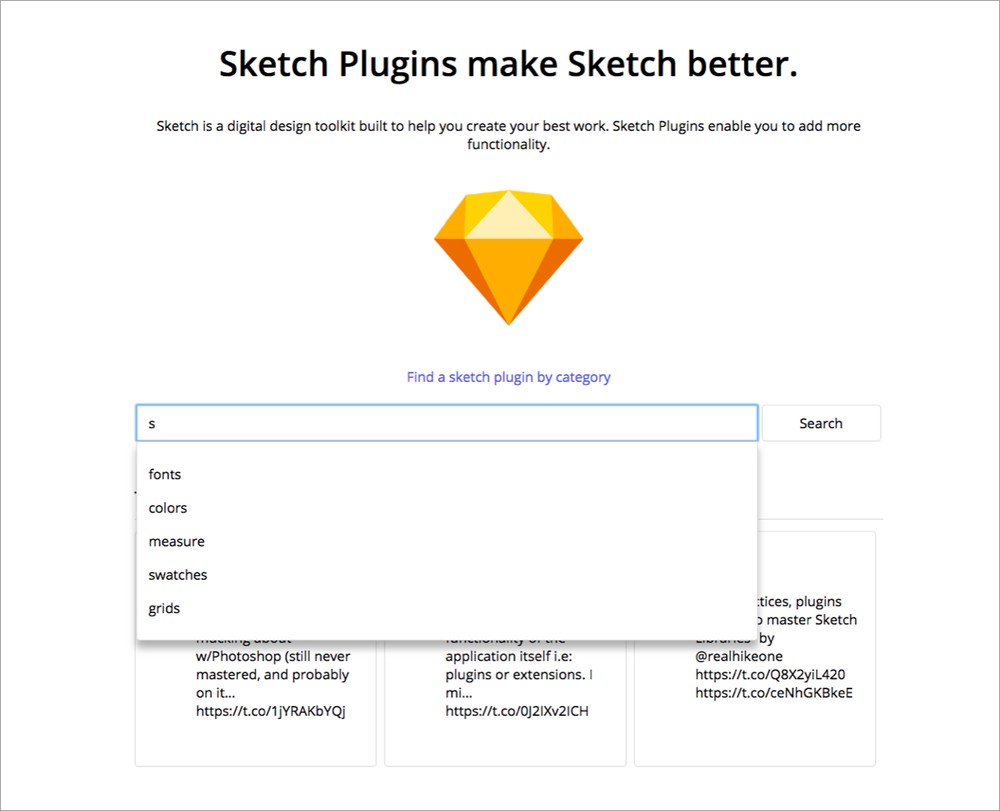

## Sketch plugin finder

[See live version](https://jessicaerazo.github.io/Sketch-App-plugin-search/)

## ScreenShots:

## Summary

Sketch plugin finder allows you to find sketch plugins and download them in one step. The application also keeps you up to date with the latest tweets regarding sketch plugins so you can always be in the know of latest trends.

## Technologies used:

HTML, CSS, Javascript, JQuery